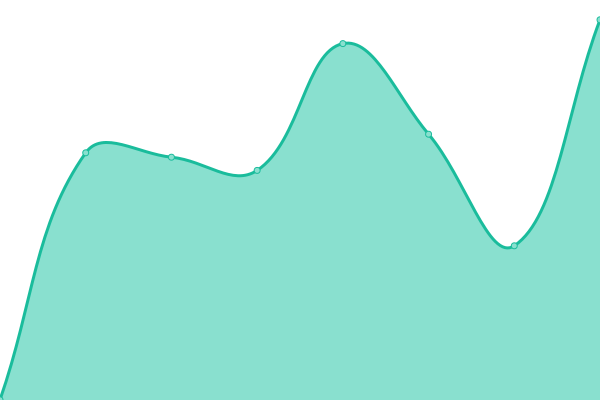

# [📈 Live Status](https://jonassalen.github.io/uptime-mechelen): <!--live status--> **🟩 All systems operational**

This repository contains the open-source uptime monitor and status page for [Jonas Salen](http://www.justgoe.be), powered by [Upptime](https://github.com/upptime/upptime).

With [Upptime](https://upptime.js.org), you can get your own unlimited and free uptime monitor and status page, powered entirely by a GitHub repository. We use [Issues](https://github.com/jonassalen/uptime-mechelen/issues) as incident reports, [Actions](https://github.com/jonassalen/uptime-mechelen/actions) as uptime monitors, and [Pages](https://jonassalen.github.io/uptime-mechelen) for the status page.

<!--start: status pages-->
<!-- This summary is generated by Upptime (https://github.com/upptime/upptime) -->
<!-- Do not edit this manually, your changes will be overwritten -->
<!-- prettier-ignore -->
| URL | Status | History | Response Time | Uptime |
| --- | ------ | ------- | ------------- | ------ |
|  [Mechelen](https://www.mechelen.be) | 🟩 Up | [mechelen.yml](https://github.com/jonassalen/uptime-mechelen/commits/HEAD/history/mechelen.yml) | 

 1571ms
     
 | 

<a href="https://jonassalen.github.io/uptime-mechelen/history/mechelen">100.00%</a>
    

|  [ZBR](https://www.zorgbedrijfrivierenland.be) | 🟩 Up | [zbr.yml](https://github.com/jonassalen/uptime-mechelen/commits/HEAD/history/zbr.yml) | 

 1090ms
     
 | 

<a href="https://jonassalen.github.io/uptime-mechelen/history/zbr">100.00%</a>
    

|  [Visit](https://visit.mechelen.be/) | 🟩 Up | [visit.yml](https://github.com/jonassalen/uptime-mechelen/commits/HEAD/history/visit.yml) | 

 1244ms
     
 | 

<a href="https://jonassalen.github.io/uptime-mechelen/history/visit">100.00%</a>
    

|  [Klimaatneutraal](https://klimaatneutraal.mechelen.be/) | 🟩 Up | [klimaatneutraal.yml](https://github.com/jonassalen/uptime-mechelen/commits/HEAD/history/klimaatneutraal.yml) | 

 1094ms
     
 | 

<a href="https://jonassalen.github.io/uptime-mechelen/history/klimaatneutraal">100.00%</a>
    

|  [Cultuurcentrum](https://cultuurcentrum.mechelen.be/) | 🟩 Up | [cultuurcentrum.yml](https://github.com/jonassalen/uptime-mechelen/commits/HEAD/history/cultuurcentrum.yml) | 

 976ms
     
 | 

<a href="https://jonassalen.github.io/uptime-mechelen/history/cultuurcentrum">100.00%</a>
    

|  [UiT in Mechelen](https://uitin.mechelen.be/) | 🟩 Up | [ui-t-in-mechelen.yml](https://github.com/jonassalen/uptime-mechelen/commits/HEAD/history/ui-t-in-mechelen.yml) | 

 0ms
     
 | 

<a href="https://jonassalen.github.io/uptime-mechelen/history/ui-t-in-mechelen">100.00%</a>
    

|  [Shoppen](https://shoppenin.mechelen.be/) | 🟩 Up | [shoppen.yml](https://github.com/jonassalen/uptime-mechelen/commits/HEAD/history/shoppen.yml) | 

 905ms
     
 | 

<a href="https://jonassalen.github.io/uptime-mechelen/history/shoppen">100.00%</a>
    

|  [Mechelen nieuw](https://mechelen-prod.hosted-temp.com/) | 🟩 Up | [mechelen-nieuw.yml](https://github.com/jonassalen/uptime-mechelen/commits/HEAD/history/mechelen-nieuw.yml) | 

 996ms
     
 | 

<a href="https://jonassalen.github.io/uptime-mechelen/history/mechelen-nieuw">100.00%</a>
    

|  [Just goe](https://www.justgoe.be/) | 🟩 Up | [just-goe.yml](https://github.com/jonassalen/uptime-mechelen/commits/HEAD/history/just-goe.yml) | 

 803ms
     
 | 

<a href="https://jonassalen.github.io/uptime-mechelen/history/just-goe">99.83%</a>
    

<!--end: status pages-->

[**Visit our status website →**](https://jonassalen.github.io/uptime-mechelen)

## 📄 License

- Powered by: [Upptime](https://github.com/upptime/upptime)
- Code: [MIT](./LICENSE) © [Jonas Salen](http://www.justgoe.be)
- Data in the `./history` directory: [Open Database License](https://opendatacommons.org/licenses/odbl/1-0/)
